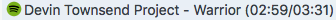
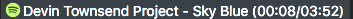
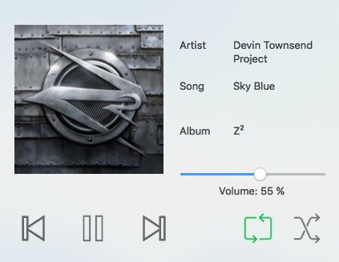
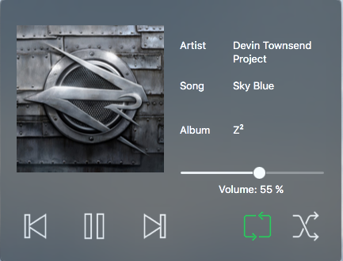
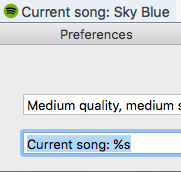

# SpotifyTicker

Status bar item to manage Spotify.

## Current features

- Full playback management
    - Play
    - Pause
    - Next/previous song
    - Shuffle/repeat toggle
    - Volume adjustment
- Support for light and dark mode

## Coming soon

- Searching
- Playlist management

## Status item format help
It is possible to adjust the text displayed in the bar to your wishes. Any character listed below on the left will be replaced with the content on the
right. Any other characters will be used as-is.



- %a - Current artist

- %s - Current song

- %A - Current album

- %p - Position in the current song

- %d - Duration of song



Default format for reference:

%a - %s (%p/%d)



Below is an example:

Get the latest build [here](https://github.com/elken/SpotifyTicker/releases/latest) or build with `xcodebuild` and get the .app in `$CLONE_DIR/build/Release/`.
